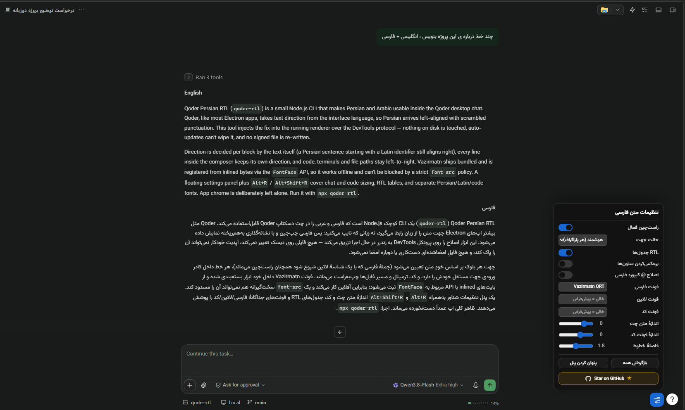

<div align="center">


# Qoder Persian RTL

[](https://www.npmjs.com/package/qoder-rtl)
[](https://www.npmjs.com/package/qoder-rtl)

[](./LICENSE)


</div>

<div dir="rtl">

### چتِ Qoder را فارسی و راست‌به‌چپ بخوانید و بنویسید

بدون دست‌زدن به فایل‌های نصب، بدون شکستنِ آپدیتِ خودکار، با فونتِ وزیرمتنِ آفلاین.

[نصب](#install) · [ویژگی‌ها](#features) · [محدودهٔ پچ](#scope) · [عیب‌یابی](#troubleshooting) · [گزارشِ فنی](./docs/REPORT.md) · [English](./README.en.md)

<br>

| قبل | بعد |
| :---: | :---: |
| فارسیِ چپ‌چین، فونتِ پیش‌فرض، کد و متن قاطی | راست‌چین، وزیرمتن، کد همچنان چپ‌به‌راست |
|  |  |

همراه پنلِ تنظیمات:



Qoder — مثل بیشترِ اپ‌های Electron — جهتِ متن را از زبانِ رابطِ کاربری می‌گیرد، نه از زبانِ چیزی که تایپ می‌کنید. نتیجه: فارسی در چت چپ‌چین می‌نشیند، پرانتزها و علامت‌ها جابه‌جا می‌شوند، و متنِ فارسیِ کنارِ کد به‌هم می‌ریزد. این ابزار همین را حل می‌کند — **فقط در چت و کادرِ نوشتن**؛ بقیهٔ برنامه دست‌نخورده می‌ماند.

<a id="features"></a>

## ویژگی‌ها

•&nbsp;&nbsp;**جهتِ هوشمند، بلوک‌به‌بلوک.** هر پاراگراف بر اساسِ متنِ خودش راست یا چپ می‌شود؛ جملهٔ فارسی‌ای که با یک شناسهٔ انگلیسی شروع می‌شود چپ‌چین نمی‌ماند. حالت‌های «همیشه راست» و «خاموش» هم در دسترس‌اند.<br>
•&nbsp;&nbsp;**در کادرِ نوشتن، هر خط جهتِ خودش را می‌گیرد.** یک کلمهٔ انگلیسی میانِ متنِ فارسی کلِ ورودی را چپ‌چین نمی‌کند؛ فقط همان خط چپ می‌ماند. این رفتار با هندسهٔ واقعیِ رندرشده در تست‌ها سنجیده می‌شود، نه با خواندنِ CSS.<br>
•&nbsp;&nbsp;**کد، ترمینال و مسیرِ فایل‌ها همیشه چپ‌به‌راست می‌مانند** — حتی داخلِ پیامی کاملاً فارسی، با فونتِ مونواسپیسِ خودِ برنامه.<br>
•&nbsp;&nbsp;**وزیرمتنِ آفلاین** از بایت‌های داخلِ خودِ ابزار ثبت می‌شود: نه دانلود، نه نصبِ فونت روی ویندوز، و حتی سیاستِ سخت‌گیرانهٔ `font-src` هم مانعش نمی‌شود.<br>
•&nbsp;&nbsp;**پیام‌های خودِ شما هم راست‌چین می‌شوند**، نه فقط پاسخ‌های ایجنت.<br>
•&nbsp;&nbsp;**پنلِ تنظیماتِ شناور** در پایینِ راستِ پنجره، به‌همراه میانبرهای صفحه‌کلید: اندازهٔ متنِ چت و کد، فاصلهٔ خطوط، راست‌چینِ جدول‌ها، و فونتِ جداگانه برای فارسی / لاتین / کد.<br>
•&nbsp;&nbsp;**هیچ فایلی در نصبِ Qoder نوشته نمی‌شود.** پچ روی پنجرهٔ در حالِ اجرا تزریق می‌شود؛ آپدیتِ خودکارِ Qoder خرابش نمی‌کند و هیچ فایلِ امضاشده‌ای تغییر نمی‌کند.

<a id="scope"></a>

## محدودهٔ پچ

| بخش | وضعیت | دلیل |
| --- | --- | --- |
| چت و کادرِ نوشتن | پچ می‌شود | هدفِ اصلیِ ابزار |
| منوها، نوارِ کناری، عنوانِ پنجره | دست‌نخورده | تا ظاهرِ کلیِ Qoder عوض نشود |
| پیش‌نمایشِ فایلِ `.md` در پنلِ سمتِ راست | دست‌نخورده | آن پنل در سندِ قابل‌اتصالِ چت نیست؛ تارگتِ دیگرِ DevTools به فرمان‌های `Page`/`Runtime`/`DOM` پاسخ نمی‌دهد، و Qoder تنظیمِ «CSS سفارشی» برای آن ندارد |
| فایل‌های روی دیسک | دست‌نخورده | برخلافِ روش‌های مبتنی بر `app.asar`، چیزی بازنویسی، پشتیبان‌گیری یا امضا نمی‌شود |

<a id="install"></a>

## نصب

**پیش‌نیاز:** فقط [Node.js](https://nodejs.org/) نسخهٔ ۲۲ یا جدیدتر — نه کلونِ ریپو، نه `npm install`.

**۱. نرم افزار Qoder را کامل ببندید،** از جمله از سینیِ کنارِ ساعت. Qoder قفلِ «تک‌نسخه» دارد: اگر برنامه باز باشد، اجرایِ تازه به همان نمونهٔ در حالِ اجرا می‌پیوندد و پرچمِ پورتِ دیباگ حذف می‌شود، پس پچ نمی‌نشیند. این ابزار هرگز خودِ Qoder را نمی‌کشد.

**۲. یک دستور بزنید:**

```powershell
npx qoder-rtl
```

نرم افزار Qoder بالا می‌آید و پچ به پنجره‌ها تزریق می‌شود. تا وقتی این ترمینال باز است پچ زنده می‌ماند و پنجره‌های تازهٔ Qoder هم خودکار پچ می‌شوند؛ با `Ctrl+C` یا بستنِ ترمینال، همه‌چیز به حالتِ اصلیِ Qoder برمی‌گردد.

**نکته:** اگر `npx` خطای ۴۰۴ داد، یعنی هنوز نسخه‌ای منتشر نشده است: ریپو را کلون کنید، داخلش `npm install` بزنید و به‌جای دستورِ بالا `node cli.js` را اجرا کنید.

**۳. صحت‌سنجی کنید:**

```powershell
npx qoder-rtl check
```

پانزده سطرِ `PASS`/`FAIL` می‌گیرید که بیشترشان اندازهٔ واقعیِ رندرشده را می‌سنجند: فونتِ محاسبه‌شدهٔ یک پاراگرافِ واقعی، بلندایِ سطر، جابه‌جاییِ ستون‌های جدول، فاصلهٔ پنل از لبهٔ پنجره. سطرِ `UNSURE` یعنی آن ویژگی در این گفت‌وگو چیزی برای سنجیدن نداشت — نه این‌که سالم است.

<a id="rerun"></a>

**نکته:** هر بار Qoder را باز می‌کنید باید ابزار را دوباره اجرا کنید. این ذاتِ تزریقِ زنده است — چیزی روی دیسک نوشته نمی‌شود، پس با هر بالا‌آمدنِ برنامه، پچ هم از نو باید اعمال شود. برای اجرایِ دابل‌کلیکی، `npx qoder-rtl launcher` یک `Qoder-RTL.cmd` می‌سازد و `npx qoder-rtl remove-launcher` پاکش می‌کند.

<a id="commands"></a>

## دستورها

| دستور                                   | کار                                                                                                                                                                 |
| -------------------------------------------- | ---------------------------------------------------------------------------------------------------------------------------------------------------------------------- |
| `qoder-rtl`                                | اتصال یا راه‌اندازیِ Qoder + تزریق، و زنده نگه‌داشتنِ پچ تا `Ctrl+C`                                                      |
| `qoder-rtl check`                          | تزریق + ممیزیِ پانزده‌سطری + گزارش در `%LOCALAPPDATA%\qoder-persian-rtl\cdp-test.log`                                                   |
| `qoder-rtl diagnose`                       | فقط‌خواندنی: نشان می‌دهد روی هر بلوکِ متن چه چیزی محاسبه شده — پاسخِ «چرا این خط راست نیست؟» |
| `qoder-rtl status`                         | نسخهٔ ابزار و payload، نسخهٔ Qoder، و وضعیتِ واقعیِ پورتِ دیباگ                                                               |
| `qoder-rtl list`                           | پنجره‌ها و targetهایی که DevTools می‌بیند                                                                                                        |
| `qoder-rtl launcher` / `remove-launcher` | ساخت یا حذفِ`Qoder-RTL.cmd` — تنها فایلی که این ابزار بیرون از پوشهٔ لاگ می‌نویسد                               |
| `qoder-rtl patch --yes`                    | ⚠️ روشِ قدیمیِ بازنویسیِ`app.asar`؛ روی Qoder ۰.۳.۳ و بالاتر کار نمی‌کند و بدون `--yes` اجرا نمی‌شود  |

<a id="shortcuts"></a>

## کلیدهای میانبر و پنل

| کلید        | کار                                                                                                 |
| --------------- | ------------------------------------------------------------------------------------------------------ |
| `Alt+R`       | روشن/خاموش‌کردنِ جهت؛ همهٔ پنجره‌های Qoder همگام می‌مانند |
| `Alt+Shift+R` | نمایش یا پنهان‌کردنِ دکمهٔ پنل                                               |
| `Escape`      | بستنِ پنل و برگرداندنِ فوکوس به دکمه                                     |

پنل با کلیک باز می‌شود (هاورِ گوشه کاری نمی‌کند)، پایینِ راست می‌نشیند تا روی متنِ در حالِ خواندن نیفتد، و تنظیماتش بینِ همهٔ پنجره‌ها همگام است.

<a id="troubleshooting"></a>

## عیب‌یابی

اول `qoder-rtl status` را بزنید؛ وضعیتِ پورت را مستقیم از ویندوز می‌پرسد و یکی از این چهار حالت را برمی‌گرداند:

| خروجی | یعنی | چاره |
| --- | --- | --- |
| `serving DevTools` | همه‌چیز آماده است | اگر پچ ننشسته، `check` بزنید و سطرهای `FAIL` را بخوانید |
| `free` | Qoder بدون پرچمِ دیباگ بالا آمده | Qoder را کامل ببندید و دوباره اجرا کنید تا خودش با پرچم بالا بیاید |
| `held by PID … (running)` | برنامهٔ دیگری پورت را گرفته | با `--port 9333` یا متغیرِ محیطیِ `QODER_RTL_PORT=9333` روی پورتِ دیگر بروید |
| `held by PID … (exited)` | سوکتِ یتیم: صاحبِ پورت مرده ولی سوکت مانده | Qoder را کامل (از جمله از سینی) ببندید یا سیستم را ری‌استارت کنید؛ این ابزار هیچ پروسه‌ای را نمی‌کشد |

**متن راست نیست ولی `check` سبز است؟**
یعنی در آن لحظه گفت‌وگویی رندر نشده بوده (`hooks=0`). یک چت باز کنید و دوباره `check` بزنید.

**پنجرهٔ دوم پچ نشده؟**
اگر سطرش `still being attached` است، یعنی آن پنجره هنوز رسم نشده؛ چند ثانیه بعد دوباره امتحان کنید.

**بعد از آپدیتِ Qoder چه؟**
هیچ. پچ روی دیسک نیست که آپدیت پاکش کند؛ فقط دوباره اجرا کنید.

<a id="security"></a>

## نکتهٔ امنیتی

این روش پورتِ دیباگِ لوکال (`127.0.0.1:9222`) را باز می‌کند که هر پروسهٔ محلی روی همان سیستم می‌تواند به آن وصل شود. با بستنِ Qoder، این پورت هم بسته می‌شود؛ روی ماشینِ اشتراکی بازش نگه ندارید. جزئیات در [SECURITY.md](./SECURITY.md).

<a id="why-not-asar"></a>

## چرا پچِ asar پیش‌فرض نیست؟

چون روی Qoder 0.3.3 برنامه را کاملاً خاموش کرد: فیوزِ `EnableEmbeddedAsarIntegrityValidation` روشن است و خودِ `Qoder.exe` با یک منبعِ `ELECTRONASAR` هشِ `app.asar` را پین کرده، پس هر بازنویسیِ آرشیو یعنی «برنامه اجرا نمی‌شود». تنها راهِ عبور دست‌زدن به فایلِ امضاشده بود؛ نه انجامش دادیم، نه توصیه‌اش می‌کنیم. روشِ DevTools دقیقاً برای دورزدنِ همین مشکل ساخته شد. تاریخچهٔ کاملِ این تصمیم و اندازه‌گیریِ پشتِ هر ادعا در [گزارشِ فنی](./docs/REPORT.md) آمده.

<a id="verification"></a>

## راستی‌آزمایی

| لایه                 | پوشش                                                                                                                                                                     |
| ------------------------ | ---------------------------------------------------------------------------------------------------------------------------------------------------------------------------- |
| `npm test`             | ۲۰۲ چکِ آفلاین — ساختارِ payload، رفتارِ CLI و گاردهایش، نگهبان‌های README، ممیزیِ آرشیوِ مرحله‌بندی‌شده                         |
| `npm run test:browser` | ۷۴ چکِ سربه‌سر روی Chromiumِ بی‌سر، با رویدادهای واقعیِ ماوس/کیبورد و اندازه‌گیریِ هندسهٔ رندرشده |
| `npx qoder-rtl check`  | ۱۶ سطر روی یک نمونهٔ واقعیِ Qoder                                                                                                                      |

هر ادعای تازه با یک «کنترلِ منفی» تأیید می‌شود: همان چک روی نسخهٔ پیش از اصلاح هم اجرا می‌شود و باید سرخ شود. چکی که روی کدِ خراب هم سبز بماند، چک حساب نمی‌شود.

<a id="contributing"></a>

## مشارکت

مسیرِ تست‌ها، قاعدهٔ «اول قرمز، بعد اصلاح»، و مرزهای دامنه (چه چیزی عمداً پچ نمی‌شود) در [CONTRIBUTING.md](./CONTRIBUTING.md) توضیح داده شده‌اند. برای گزارشِ باگ یک [Issue](https://github.com/Pezhm4n/qoder-rtl/issues) باز کنید؛ یک اسکرین‌شات از لحظهٔ خطا از هر توضیحی ارزشمندتر است.

## مجوز

**نرم‌افزار:** MIT — [LICENSE](./LICENSE)<br>
**فونتِ وزیرمتنِ بسته‌شده:** SIL Open Font License 1.1 — [`assets/OFL.txt`](./assets/OFL.txt) و پروژهٔ [Vazirmatn](https://github.com/rastikerdar/vazirmatn)

</div>

<div align="center">

[Read this in English →](./README.en.md)


</div>