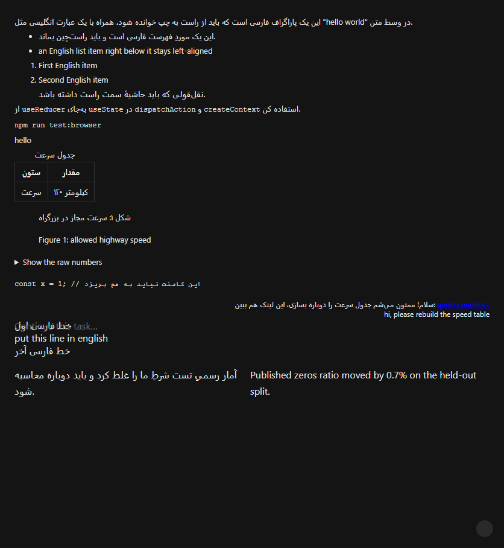
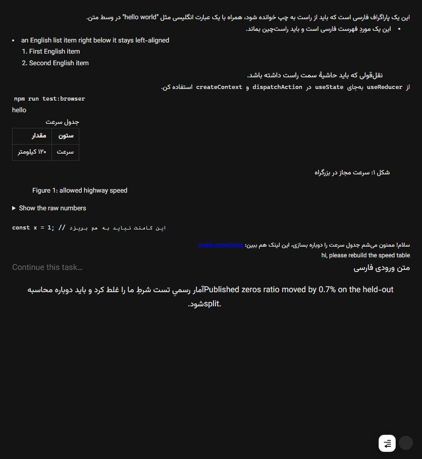

<div align="center">

# Qoder Persian RTL

[](https://www.npmjs.com/package/qoder-rtl)
[](https://www.npmjs.com/package/qoder-rtl)

[](./LICENSE)


</div>

<div dir="rtl">

**چتِ Qoder را فارسی و راست‌به‌چپ بخوانید و بنویسید؛ بدون دست‌زدن به فایل‌های نصب، بدون شکستنِ آپدیتِ خودکار، با فونتِ وزیرمتنِ آفلاین.**

[نصب](#install) · [چه می‌کند](#features) · [عیب‌یابی](#troubleshooting) · [چه پچ نمی‌شود](#scope) · [گزارشِ فنی](./docs/REPORT.md) · [English](./README.en.md)

| قبل: فارسیِ چپ‌چین، فونتِ پیش‌فرض، کد و متن قاطی | بعد: راست‌چین، وزیرمتن، کد همچنان چپ‌به‌راست |
| :---: | :---: |
|  |  |

Qoder — مثل بیشتر اپ‌های Electron — جهتِ متن را از زبانِ **رابطِ کاربری** می‌گیرد، نه از زبانِ چیزی که تایپ می‌کنید. نتیجه: فارسی در چت چپ‌چین می‌نشیند، پرانتز و علامت‌ها جابه‌جا می‌شوند و `متن فارسی کنار کد` به‌هم می‌ریزد. این ابزار همان را حل می‌کند — **فقط در چت و کادرِ نوشتن**؛ بقیهٔ برنامه دست‌نخورده می‌ماند.

<a id="features"></a>

## چه می‌کند

- **جهتِ هوشمند، بلوک‌به‌بلوک.** هر پاراگراف بر اساسِ متنِ خودش راست یا چپ می‌شود؛ جملهٔ فارسی‌ای که با یک شناسهٔ انگلیسی شروع می‌شود چپ‌چین نمی‌شود. حالت‌های «همیشه راست» و «خاموش» هم هست.
- **در کادرِ نوشتن، هر خط جهتِ خودش را می‌گیرد.** یک کلمهٔ انگلیسی میانِ متنِ فارسی کلِ ورودی را چپ‌چین نمی‌کند؛ همان خط چپ می‌ماند و بقیه راست. این با هندسهٔ هر خط در تست‌ها سنجیده می‌شود، نه با خواندنِ CSS.
- **کد، ترمینال و مسیرِ فایل‌ها چپ‌به‌راست می‌مانند** — حتی داخلِ یک پیامِ کاملاً فارسی، با فونتِ مونواسپیسِ خودِ برنامه.
- **وزیرمتن آفلاین** داخلِ خودِ ابزار است: نه دانلود، نه نصبِ فونت روی ویندوز. فونت از بایت‌های درونِ برنامه ثبت می‌شود، پس سیاستِ سخت‌گیرانهٔ `font-src` هم جلویش را نمی‌گیرد.
- **خودِ پیام‌های شما هم** مثلِ پاسخ‌ها راست‌چین می‌شوند، نه فقط خروجیِ ایجنت.
- **پنلِ تنظیمات شناور** در پایینِ راستِ پنجره، به‌همراه `Alt+R` (تغییرِ جهت) و `Alt+Shift+R` (نمایش/پنهان‌کردنِ پنل): اندازهٔ متنِ چت، اندازهٔ فونتِ کد، فاصلهٔ خطوط، راست‌چینِ جدول‌ها و برعکس‌کردنِ ستون‌ها، و فونتِ جدا برای فارسی / لاتین / کد.
- **هیچ فایلی در نصبِ Qoder نوشته نمی‌شود.** پچ روی پنجرهٔ در حالِ اجرا تزریق می‌شود؛ آپدیتِ خودکارِ Qoder آن را خراب نمی‌کند و هیچ فایلِ امضاشده‌ای تغییر نمی‌کند.

<a id="scope"></a>

## چه چیزی پچ نمی‌شود، و چرا

- **رابطِ کاربریِ برنامه.** منوها، عنوانِ گفت‌وگوها در نوارِ کناری، عنوانِ پنجره و دکمه‌ها عمداً چپ‌چین می‌مانند تا ظاهرِ Qoder عوض نشود.
- **پیش‌نمایشِ فایلِ `.md` در پنلِ سمتِ راست.** اندازه‌گیری شد، حدس نبود: آن پنل در سندِ قابل‌اتصالِ چت نیست، تنها تارگتِ دیگرِ DevTools به هیچ‌کدام از فرمان‌های `Page` / `Runtime` / `DOM` پاسخ نمی‌دهد، و Qoder تنظیمِ «CSS سفارشی» برای آن ندارد. پس نه از این ابزار می‌شود به آن رسید، نه با یک قانونِ CSS.
- **هیچ‌چیز روی دیسک.** برخلافِ روش‌های مبتنی بر `app.asar`، چیزی بازنویسی، پشتیبان‌گرفته یا امضا نمی‌شود.

<a id="install"></a>

## نصب

**پیش‌نیاز:** فقط [Node.js](https://nodejs.org/) نسخهٔ ۲۲ یا جدیدتر. نه کلون‌کردنِ ریپو، نه `npm install`.

**۱) Qoder را کامل ببندید.** Qoder قفلِ «تک‌نسخه» دارد: اگر برنامه باز باشد، اجرایِ تازه به همان نسخهٔ در حالِ اجرا می‌پیوندد و پرچمِ پورتِ دیباگ حذف می‌شود، پس پچ نمی‌نشیند. از سینیِ کنارِ ساعت هم خارجش کنید. این ابزار هرگز خودِ Qoder را نمی‌کشد.

**۲) یک دستور بزنید:**

```powershell
npx qoder-rtl
```

Qoder بالا می‌آید و پچ به پنجره‌ها تزریق می‌شود. تا وقتی این ترمینال باز است پچ زنده می‌ماند و پنجره‌های تازهٔ Qoder هم خودکار پچ می‌شوند؛ با `Ctrl+C` یا بستنِ ترمینال، همه‌چیز به حالتِ اصلیِ Qoder برمی‌گردد.

> اگر `npx` خطای 404 داد یعنی هنوز نسخه‌ای منتشر نشده است: ریپو را کلون کنید، داخلش `npm install` بزنید و به‌جای دستورِ بالا `node cli.js` را اجرا کنید.

**۳) مطمئن شوید نشسته است:**

```powershell
npx qoder-rtl check
```

پانزده سطر `PASS/FAIL` می‌گیرید که بیشترشان **اندازهٔ واقعیِ رندرشده** است: فونتِ محاسبه‌شدهٔ یک پاراگرافِ واقعی، بلندای سطر، جابه‌جاییِ ستون‌های جدول، فاصلهٔ پنل از لبهٔ پنجره. سطرِ `UNSURE` یعنی آن ویژگی در این گفت‌وگو چیزی برای سنجیدن نداشت، نه این‌که سالم است.

<a id="rerun"></a>

> **هر بار که Qoder را باز می‌کنید باید دوباره اجرا شود.** این ذاتِ تزریقِ زنده است: چیزی روی دیسک نوشته نمی‌شود، پس با هر بالا آمدنِ برنامه پچ هم می‌رود. اگر دابل‌کلیک را ترجیح می‌دهید، `npx qoder-rtl launcher` یک `Qoder-RTL.cmd` می‌سازد و `npx qoder-rtl remove-launcher` پاکش می‌کند.

<a id="commands"></a>

## فرمان‌ها

| فرمان | کار |
| --- | --- |
| `qoder-rtl` (بدون نام) | اتصال یا راه‌اندازی + تزریق، و زنده نگه‌داشتنِ پچ تا `Ctrl+C` |
| `qoder-rtl check` | تزریق + ممیزیِ پانزده‌سطری + گزارش در `%LOCALAPPDATA%\qoder-persian-rtl\cdp-test.log` |
| `qoder-rtl diagnose` | فقط‌خواندنی: روی هر بلوکِ متن چه چیزی **محاسبه** شده — پاسخِ «چرا این خط راست نیست؟» |
| `qoder-rtl status` | نسخهٔ ابزار و payload، نسخهٔ Qoder، و وضعیتِ واقعیِ پورتِ دیباگ |
| `qoder-rtl list` | پنجره‌ها و targetهایی که DevTools می‌بیند |
| `qoder-rtl launcher` / `remove-launcher` | ساخت یا پاک‌کردنِ `Qoder-RTL.cmd` — تنها فایلی که این ابزار بیرونِ پوشهٔ لاگ می‌نویسد |
| `qoder-rtl patch --yes` | ⚠️ روشِ قدیمیِ بازنویسیِ `app.asar`؛ روی Qoder 0.3.3 و بالاتر **کار نمی‌کند** و بدون `--yes` اجرا نمی‌شود |

<a id="shortcuts"></a>

## کلیدها و پنل

| کلید | کار |
| --- | --- |
| `Alt+R` | روشن/خاموش‌کردنِ جهت؛ همهٔ پنجره‌های Qoder همگام می‌مانند |
| `Alt+Shift+R` | نمایش یا پنهان‌کردنِ دکمهٔ پنل |
| `Escape` | بستنِ پنل و برگرداندنِ فوکوس به دکمه |

پنل با **کلیک** باز می‌شود (هاورِ گوشه کاری نمی‌کند)، پایینِ راست می‌نشیند تا روی پاسخی که می‌خوانید نیفتد، و تنظیماتش بینِ پنجره‌ها همگام است.

<a id="troubleshooting"></a>

## عیب‌یابی

اول `qoder-rtl status` را بزنید؛ وضعیتِ پورت را از خودِ ویندوز می‌پرسد و یکی از این چهار حالت را می‌گوید:

| چه می‌بینید | یعنی | چاره |
| --- | --- | --- |
| `serving DevTools` | همه‌چیز آماده است | اگر پچ نیست، `check` بزنید و سطرهای `FAIL` را بخوانید |
| `free` | Qoder بدون پرچمِ دیباگ بالا آمده | Qoder را کامل ببندید و دوباره اجرا کنید تا خودش با پرچم بالا بیاورد |
| `held by PID … (running)` | برنامهٔ دیگری پورت را گرفته | با `--port 9333` یا `QODER_RTL_PORT=9333` روی پورتِ دیگر بروید |
| `held by PID … (exited)` | سوکتِ یتیم: صاحبِ پورت مرده ولی سوکت مانده | Qoder را کامل (با سینی) ببندید یا ری‌استارت کنید؛ ما هیچ پروسه‌ای را نمی‌کشیم |

**متن راست نیست ولی `check` سبز است؟** در آن لحظه گفت‌وگویی رندر نشده (`hooks=0`)؛ یک چت باز کنید و دوباره `check` بزنید.

**پنجرهٔ دوم پچ نشده؟** اگر سطرش `still being attached` است یعنی آن پنجره هنوز نقاشی نشده؛ چند ثانیه بعد دوباره امتحان کنید.

**بعد از آپدیتِ Qoder چه؟** هیچ؛ پچ روی دیسک نیست که آپدیت پاکش کند. فقط دوباره اجرا کنید.

<a id="security"></a>

## نکتهٔ امنیتی

این روش پورتِ دیباگِ لوکال (`127.0.0.1:9222`) را باز می‌کند که **هر پروسهٔ محلی** می‌تواند رانش کند. با بستنِ Qoder بسته می‌شود؛ روی ماشینِ اشتراکی باز نگهش ندارید. جزئیات در [SECURITY.md](./SECURITY.md).

<a id="why-not-asar"></a>

## چرا «پچِ asar» پیش‌فرض نیست؟

چون روی Qoder 0.3.3 برنامه را **خاموش** کرد: فیوزِ `EnableEmbeddedAsarIntegrityValidation` روشن است و خودِ `Qoder.exe` با یک منبعِ `ELECTRONASAR` هشِ `app.asar` را پین کرده، پس هر بازنویسیِ آرشیو یعنی «برنامه اجرا نمی‌شود». تنها راهِ عبور دست‌زدن به فایلِ امضاشده بود؛ انجامش ندادیم و توصیه هم نمی‌کنیم. روشِ DevTools دقیقاً برای همین ساخته شد. تاریخچهٔ کاملِ این تصمیم و هر اندازه‌گیری پشتِ هر ادعا در [گزارشِ فنی](./docs/REPORT.md) است.

<a id="verification"></a>

## راستی‌آزمایی

- `npm test` → **۱۸۱** چکِ آفلاین: ساختارِ payload، رفتارِ CLI و گاردهایش، ممیزیِ آرشیوِ مرحله‌بندی‌شده
- `npm run test:browser` → **۶۴** چکِ سرِبه‌سر روی Chromiumِ بی‌سر، با رویدادهای واقعیِ ماوس و کیبورد و اندازه‌گیریِ هندسهٔ رندرشده
- `npx qoder-rtl check` → **۱۵ سطر** روی Qoderِ واقعی

هر ادعای تازه با «کنترلِ منفی» تأیید می‌شود: روی نسخهٔ **قبلِ** اصلاح اجرا می‌شود و باید **سرخ** شود. چکی که روی کدِ خراب سبز بماند، چک نیست.

<a id="contributing"></a>

## مشارکت

مسیرِ تست‌ها، قاعدهٔ «اول قرمز، بعد اصلاح» و مرزهای دامنه (چه چیزی عمداً پچ نمی‌شود) در [CONTRIBUTING.md](./CONTRIBUTING.md) نوشته شده. برای گزارشِ باگ یک [Issue](https://github.com/Pezhm4n/qoder-rtl/issues) باز کنید؛ اگر می‌نویسید «فلان‌جا راست‌چین نشد»، یک اسکرین‌شات از همان لحظه از هر توضیحی ارزشمندتر است.

## مجوز

- نرم‌افزار: MIT — [LICENSE](./LICENSE)
- فونتِ وزیرمتنِ بسته‌شده: SIL Open Font License 1.1 — [`assets/OFL.txt`](./assets/OFL.txt) و پروژهٔ [Vazirmatn](https://github.com/rastikerdar/vazirmatn)

</div>

<div align="center">

[Read this in English →](./README.en.md)


</div>
